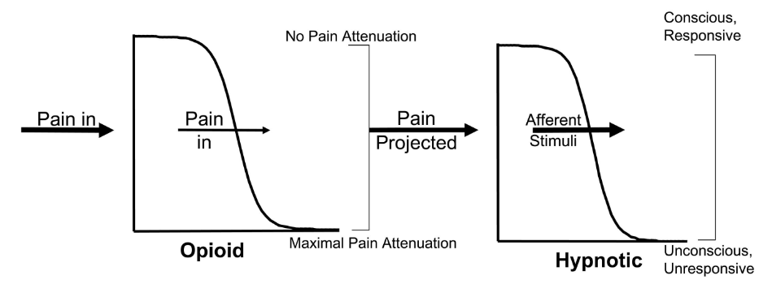
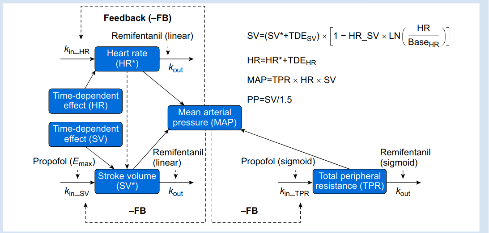
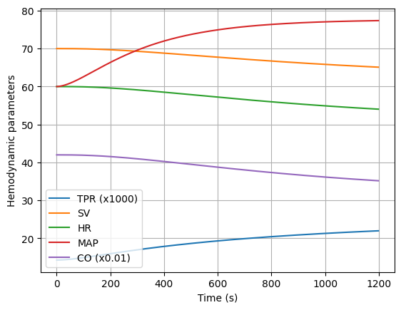
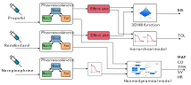

Pharmacodynamics
=================

While the mechanism of the pharmacokinetic is still poorly understood, the mechanism of actions of drugs at the molecular level is better understood (Bailey2005_). However, the link between the molecular level and the measured physiological variables is complex and thus, the pharmacodynamics models are usually empirical. The most common approach is to use the Hill function to describe the effect of the drug concentration on the physiological variables. The Hill function is a sigmoid function defined by the following equation:

.. math::

    E(t) = E_{max} \frac{C(t)^\gamma}{C(t)^\gamma + EC_{50}^\gamma}

where :math:`E(t)` is the effect of the drug at time :math:`t`, :math:`E_{max}` is the maximal effect, :math:`C(t)` is the drug concentration at time :math:`t`, :math:`\gamma` is the Hill coefficient, and :math:`EC_{50}` is the half-effect concentration (i.e., the concentration to obtain half the effect of the drugs). Figure below is an illustration of the sigmoid function for different values of the Hill coefficient and half-effect concentration.

.. figure:: ../images/sigmoid.png
   :width: 60%
   :align: center
   :alt: Sigmoid function

For propofol and remifentanil, before applying the Hill function, an effect-site compartment is added to the PK model to represent a delay between a rise of drug concentration in blood and the occurrence of the effect. This delay is dependent on the physiological variables, and thus, multiple effect-site compartments can be added to the model. As those compartments are virtual, the drug transfer is considered in only one direction, from blood to the effect site without affecting the blood compartment concentration. Thus, the addition of the effect site does not affect the PK model. The equation for one effect-site compartment is given by:

.. math::

    \dot{x}_{es}(t) = k_{e0} (x_1(t) - x_{es}(t))

where :math:`x_{es}(t)` is the drug concentration in the effect site, :math:`x_1(t)` is the drug concentration in blood, and :math:`k_{e0}` is the rate of drug transfer from blood to effect site. This leads to the full compartment model given in the next figure.

.. figure:: ../images/4_comportment_model.png
   :width: 70%
   :align: center
   :alt: Four-compartment model

   Four-compartment model for propofol and remifentanil.

In the simulator, we slightly abuse the notation and included the effect-site compartments in the PK model in order to keep all the dynamical system in the same state-space representation.  

BIS
------

If pharmacokinetics models usually assume no interaction between drugs, pharmacodynamics models should express the synergy or the antagonism between drugs. For the effect of propofol and remifentanil on the BIS, a 3D-Hill function is used to express the drug's synergy:

.. math::
    :label: eq:3DHill

    BIS(t) = BIS_{0} - E_{max} \frac{I(t)^\gamma}{1 + I(t)^\gamma}

with :math:`BIS_0` the initial BIS, :math:`E_{max}` the maximum effect of combined drugs, :math:`\gamma` the slope coefficient of the Hill curve and :math:`I(t)` the interaction term defined by:

.. math::

    I(t) = \frac{I_p(t) + I_r(t)}{1 - \beta \theta(t) + \beta \theta(t)^2}

where:

.. math::

    I_p(t) = \frac{x_{ep,BIS}(t)}{C_{50p,BIS}};\quad
    I_r(t) = \frac{x_{er,BIS}(t)}{C_{50r,BIS}};\quad
    \theta(t) = \frac{I_p(t)}{I_p(t)+I_r(t)}

In those equations, :math:`x_{ep,BIS}` and :math:`x_{er,BIS}` are the propofol and remifentanil concentrations of the BIS effect site, :math:`C_{50p,BIS}` and :math:`C_{50r,BIS}` are the propofol and remifentanil half-effect concentrations for BIS, and :math:`\beta` is the interaction term between the two drugs.

Few studies have been conducted on the pharmacodynamic part of the anesthesia process, and the models are less standardized. In this simulator, the values of the parameters of the 3D-Hill function are taken from the study of Bouillon2004_. The surface of the 3D-Hill function with the values from the mentioned study is shown in the figure below.

.. figure:: ../images/3Dhill.png
   :width: 80%
   :align: center
   :alt: 3D-Hill function

Tolerance of Laryngoscopy
-----------------------------

To output an indicator of analgesia in the simulator, we used the Tolerance of Laryngoscopy (TOL). The TOL is defined as the probability of reaction of the patient to the laryngoscopy. In Bouillon2004_, the authors proposed a hierarchical model to link drug effect site concentration to TOL. The model is given by:

.. math:: postopioid(t) = preopioid \times \left(1 - \frac{x_{er,BIS}(t)^{\gamma_r}}{x_{er,BIS}(t)^{\gamma_r} + (C_{r,50,TOL} \times preopioid)^{\gamma_r}}\right)
.. math:: TOL(t) = \frac{x_{ep,BIS}(t)^{\gamma_p}}{x_{ep,BIS}(t)^{\gamma_p} + (C_{p,50,TOL} \times postopioid(t))^{\gamma_p}}

where :math:`preopioid` is the tolerance of laryngoscopy without remifentanil, :math:`x_{er,BIS}(t)` and :math:`x_{ep,BIS}(t)` are the remifentanil and propofol concentration in the TOL effect site (same than the BIS effect site), :math:`C_{r,50,TOL}` and :math:`C_{p,50,TOL}` are the remifentanil and propofol half-effect concentrations for TOL. This model is illustrated in the figure below.

   Hierarchical model for TOL, figure from Bouillon2004_.

Haemodynamic
--------------

Haemodynamics are the dynamic of blood flow. Blood flow ensures the transportation of nutrients, hormones, metabolic waste products, oxygen, and carbon dioxide throughout the body to maintain cell-level metabolism, the regulation of the pH, osmotic pressure and temperature of the whole body, and the protection from microbial and mechanical harm.

The main variable to monitor is the cardiac output (CO), which is the volume of blood pumped by the heart per minute as it is the main determinant of oxygen delivery to tissues. However, CO is not directly measurable, and thus, the mean arterial pressure (MAP) is often used as a surrogate. The MAP is the average arterial pressure during one cardiac cycle, and it is considered to be a good indicator of perfusion pressure in the organs. The CO and MAP are influenced by the drugs used during anesthesia, and thus, it is important to model their effects.

For the effect of propofol and remifentanil on MAP and CO, the interaction of drugs has been studied in Su2023_ using a general pharmacodynamic interaction model. In this dynamical model, three variable are considered to be dynamic: the total peripheral resistance (TPR), the stroke volume (SV), and the heart rate (HR). They respectively represent the resistance of the blood vessels, the volume of blood pumped by the heart per beat, and the number of heartbeats per minute. They are related to the MAP and CO by the following equations:

.. math::
    :label: eq:hemodynamic

    MAP(t) = TPR(t) \times CO(t)

    CO(t) = SV(t) \times HR(t)

The idea of this model is to consider that TPR, SV and HR are autoregulated by the body through measurement of the MAP (from baroreflexes). Particularly the following equations are used to model the TPR, SV and HR without drugs:

.. math::
    \dot{TPR}(t) = \frac{k_{in\_TPR}}{RMAP(t)^{FB}} - k_{out} TPR(t)

    \dot{SV}(t) =  \frac{k_{in\_SV}}{RMAP(t)^{FB}} - k_{out} SV(t)

    \dot{HR}(t) =  \frac{k_{in\_HR}}{ RMAP(t)^{FB}} - k_{out} HR(t)

where :math:`RMAP(t)` is the normalized MAP thanks to the baseline MAP, :math:`k_{in\_TPR}`, :math:`k_{in\_SV}`, and :math:`k_{in\_HR}` are the gain of the feedback loop for TPR, SV and HR, respectively, and :math:`k_{out}` is the decay rate of TPR, SV and HR. The exponent :math:`FB` is a feedback exponent that determines the sensitivity of the feedback loop to changes in MAP.

In Su2023_, the effect of propofol and remifentanil is modelled as a perturbation of this autoregulation. In addition, a time dependant effect have been added to the model to describe elevated MAP, HR, and PP before anesthesia induction. Finally, a non-linear relationship between SV and HR is considered to represent the effect of shorter left ventricular filling time because of increased HR thereby decreasing SV

.. math::
    \begin{align}
    \dot{TPR}(t) &= \frac{k_{in\_TPR}}{RMAP(t)^{FB}}(1 + EFF_{prop\_TPR}(t)) - k_{out} TPR(t) (1 - EFF_{remi\_TPR}(t)) \\
    \dot{SV}^*(t) &=  \frac{k_{in\_SV}}{RMAP(t)^{FB}}(1 + EFF_{prop\_SV}(t)) - k_{out} SV^*(t) (1 - EFF_{remi\_SV}(t))\\
    \dot{HR}^*(t) &=  \frac{k_{in\_HR}}{ RMAP(t)^{FB}} - k_{out} HR^*(t) (1 - EFF_{remi\_HR}(t))\\
    \dot{TDE\_SV}(t) &= - k_{TDE} TDE\_SV (t)\\
    \dot{TDE\_HR}(t) &= - k_{TDE} TDE\_HR (t)
    \end{align}

with the effect of drugs on TPR, SV and HR given by the following sigmoidal functions:

.. math::
    \begin{align}
    EFF_{prop\_TPR}(t) &= \left( Emax_{propo, tpr} + int_{tpr} \cdot \frac{cp_{remi}(t)}{cp_{remi}(t) + c50_{remi, tpr}} \right) \cdot \frac{cp_{propo}(t)^{\gamma_{propo, tpr}}}{cp_{propo}(t)^{\gamma_{propo, tpr}} + c50_{propo, tpr}^{\gamma_{propo, tpr}}}\\
    EFF_{remi, SV}(t) &= \left( sl_{remi, sv} + int_{sv} \cdot \frac{cp_{propo}(t)}{cp_{propo}(t) + c50_{propo, sv}} \right) \cdot cp_{remi}(t)\\
    EFF_{remi, HR}(t) &= \left( sl_{remi, hr} + int_{hr} \cdot \frac{cp_{propo}(t)}{cp_{propo}(t) + c50_{int, hr}} \right)\cdot cp_{remi}(t)\\
    EFF_{prop, DV}(t) &= Emax_{propo, sv} \cdot \frac{cp_{propo}(t)}{cp_{propo}(t) + c50_{propo, sv}} \\
    EFF_{remi, TPR}(t) &= Emax_{remi, tpr} \cdot \frac{cp_{remi}(t)}{cp_{remi}(t) + c50_{remi, tpr}}
    \end{align}

Then the output are computed with the following equations:

.. math::
    \begin{align}
    HR(t) &= HR^*(t) + TDE\_HR(t) \\
    SV(t) &= (SV^*(t) + TDE\_SV(t)) (1- \alpha log(HR(t)/HR_0)) \\
    CO(t) &= SV(t) \times HR(t) \\
    MAP(t) &= TPR(t) \times CO(t)
    \end{align}

An illustration of this model is given below:

   Mechanically based pharmacodynamic model for haemodynamic effects, figure from Su2023_.

The Norepinephrine effect ahve not been yet included in this dynamical model. However, it exists direct pharmacodynamic models, linking the blood concentration of norepinephrine to the increase of MAP ([Beloeil2005_], [Oualha2014_]) using a sigmoid function. As it is known that norepinephrine has a direct effect on TPR, we considered that the norepinephrine affect MAP through TPR to reach the effect identified in the literature. To be explicite, when doing the simulation with norepinephrine, two different system are simulated: one with olny the effect of propofol and remifentanil, and one with the effect of norepinephrine. The difference between the two is that the dynamic of TPR is modified to reach the desired MAP. Particularly:

.. math::
  MAP\_wanted(t) = MAP_{no\_nore}(t) + norepinephrine\_effect(t)

where :math:`MAP_{no\_nore}(t)` is the MAP computed without norepinephrine, and :math:`norepinephrine\_effect(t)` is the effect of norepinephrine on MAP give using a sigmoid function. The dynamic of TPR in the system including the effect of norepinephrine is then given by:

.. math::
  \begin{align}
  \dot{TPR}(t) = & \frac{k_{in\_TPR}}{RMAP(t)^{FB}}(1 + EFF_{prop\_TPR}(t)) \\
  & - k_{out} TPR(t) (1 - EFF_{remi\_TPR}(t)) \\
  & \textcolor{blue}{ + k_{nore}(MAP_{wanted}(t)- MAP(t))}
  \end{align}

The term in blue ensure that MAP is converging to the desired value, :math:`MAP_{wanted}`, :math:`k_{nore}` is choosen to have a fast convergence without too much oscillation. Then the dynamic of HR and SV are computed as in the system without norepinephrine. This approach allows to make use of the previous results on norepinephrine effect on MAP while keeping valid the dynamical model of Su2023_. Particularly, it allow to model the effect of norepinephrine on SV, HR, and CO without having to infer new parameters for the model. As seen in the figure below, the simulator model the effect of norepinephrine on the whole haemodynamic system by merging the effect on MAP and the dynamic of TPR, SV, and HR.

   Effect of a constant injection of norepinephrine (0.1µg/s) on the haemodynamic system.

Please note that this "tricks" makes the important approximation that the effect of norepinephrine on MAP is only through TPR which might not be true. Thus, we are looking forward to a complete pharmacodynamic model including the effect of norepinephrine along with the one of propofol and remifentanil. 

Effect summary
-----------------

The overall model of anesthesia process is given by connecting the PK model and the different PD models. This can be ilustrated with the following figure:

   Overall model scheme

The following table summarizes the effect of single drugs injection on the model outputs:

.. raw:: html

    

    <table class="colored-table">
      <thead>
        <tr>
          <th></th>
          <th>Propofol</th>
          <th>Remifentanil</th>
          <th>Norepinephrine</th>
        </tr>
      </thead>
      <tbody>
        <tr>
          <th>BIS</th>
          <td class="blue-bg">-</td>
          <td class="blue-bg">-</td>
          <td>No effect</td>
        </tr>
        <tr>
          <th>TOL</th>
          <td class="red-bg">+</td>
          <td class="red-bg">+</td>
          <td>No effect</td>
        </tr>
        <tr>
          <th>MAP</th>
          <td class="blue-bg">-</td>
          <td class="blue-bg">-</td>
          <td class="red-bg">+</td>
        </tr>
        <tr>
          <th>CO</th>
          <td class="red-bg">+</td>
          <td class="red-bg">+</td>
          <td class="blue-bg">-</td>
        </tr>
        <tr>
          <th>TPR</th>
          <td class="blue-bg">-</td>
          <td class="blue-bg">-</td>
          <td class="red-bg">+</td>
        </tr>
        <tr>
          <th>SV</th>
          <td class="blue-bg">-</td>
          <td class="red-bg">+</td>
          <td class="blue-bg">-</td>
        </tr>
        <tr>
          <th>HR</th>
          <td class="red-bg">+</td>
          <td class="red-bg">+</td>
          <td class="blue-bg">-</td>
        </tr>
      </tbody>
    </table>

References
----------

.. [Bailey2005]     J. M. Bailey and W. M. Haddad, “Drug dosing control in clinical pharmacology,” *IEEE Control Systems Magazine*,
    vol. 25, no. 2, pp. 35–51, Apr. 2005, doi: https://doi.org/10.1109/MCS.2005.1411383.
.. [Bouillon2004] T. W. Bouillon et al., “Pharmacodynamic Interaction between Propofol and Remifentanil
    Regarding Hypnosis, Tolerance of Laryngoscopy, Bispectral Index, and Electroencephalographic Approximate
    Entropy,” Anesthesiology, vol. 100, no. 6, pp. 1353–1372, Jun. 2004, doi: https://doi.org/10.1097/00000542-200406000-00006.
..  [Beloeil2005]  H. Beloeil, J.-X. Mazoit, D. Benhamou, and J. Duranteau, “Norepinephrine kinetics and dynamics
    in septic shock and trauma patients,” BJA: British Journal of Anaesthesia, vol. 95, no. 6,
    pp. 782–788, Dec. 2005, doi: https://doi.org/10.Beloeil20051093/bja/aei259.
..  [Su2023] H. Su, J. V. Koomen, D. J. Eleveld, M. M. R. F. Struys, and P. J. Colin, “Pharmacodynamic
    mechanism-based interaction model for the haemodynamic effects of remifentanil and propofol in healthy
    volunteers,” British Journal of Anaesthesia, vol. 131, no. 2, pp. 222–233, Aug. 2023,
    doi: https://10.1016/j.bja.2023.04.043.
.. [Oualha2014] M. Oualha et al., “Population pharmacokinetics and haemodynamic effects of norepinephrine
        in hypotensive critically ill children,” British Journal of Clinical Pharmacology,
        vol. 78, no. 4, pp. 886–897, 2014, doi: https://10.1111/bcp.12412.

