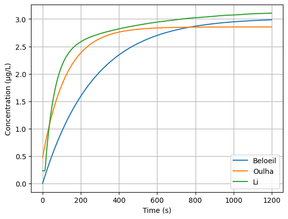

Pharmacokinetics
================

The most common approach for modeling pharmacokinetics is based on compartmental models. The concept is to consider the body as one or several compartments and describe the drug concentration in each compartment (Bailey2005_). The drug is assumed to be homogeneously distributed in each compartment, and the transport rate between compartments is assumed to be proportional to the drug concentration. Although this is a crude simplification of reality, it is a powerful tool for the prediction of the drug concentration in the body. Moreover, the freedom of the number of compartments allows to reach a good compromise between accuracy and complexity depending on available data.

.. figure:: ../images/3_comportment_model.png
   :alt: Three-compartment model for propofol and remifentanil.
   :align: center
   :width: 70%

   Three-compartment model for propofol and remifentanil.

Propofol and remifenantil
-------------------------

For propofol and remifentanil, a three-compartment model is commonly used, see the figure above. The first compartment is the central compartment, which represents blood and highly perfused organs such as the heart, brain, kidney and liver. Then the two peripherical compartments respectively represent the highly perfused tissues such as muscles, and the poorly perfused tissues such as fat. The model results in a dynamical system described by the following state-space representation:

.. math::

    \begin{pmatrix}
    \dot{x}_1(t) \\ \dot{x}_2 (t)\\ \dot{x}_3(t)
    \end{pmatrix}
    =
    \begin{pmatrix}
    -(k_{10} + k_{12} + k_{13}) & k_{12} & k_{13} \\
    k_{21} & -k_{21} & 0\\
    k_{31} & 0 & -k_{31}
    \end{pmatrix}
    \begin{pmatrix}
    x_1 (t)\\ x_2 (t)\\ x_3(t)
    \end{pmatrix}
    +
    \begin{pmatrix}
    \frac{1}{V_1} \\ 0\\ 0
    \end{pmatrix}
    u(t)

where :math:`x_1(t), x_2(t)` and :math:`x_3(t)` respectively represent drug concentration in blood, muscle and fat in :math:`\mathrm{mg/ml}` for propofol and :math:`\mathrm{µg/ml}` for remifentanil. The coefficients can be obtained from the equations below, all in :math:`\mathrm{1/s}`:

.. math::

    k_{10} = \frac{Cl_1}{V_1},\quad
    k_{12} = \frac{Cl_2}{V_1},\quad
    k_{13} = \frac{Cl_3}{V_1},\quad
    k_{21} = \frac{Cl_2}{V_2},\quad
    k_{31} = \frac{Cl_3}{V_3}

where :math:`V_i` and :math:`Cl_i` for :math:`i \in \{1,2,3\}` are, respectively, the volumes and the clearance rates of each compartment. The input :math:`u(t)` is the drug infusion rate in :math:`\mathrm{mg/s}` for propofol and :math:`\mathrm{µg/s}` for remifentanil.

Multiple studies have been conducted to estimate the parameters of the PK model for propofol and remifentanil depending on the patient's characteristics (age, height, weight, and sex). The most commonly used in clinical practice are the models of Scnnider1999_ and Marsh1991_ for propofol, and the model of Minto1997_ for remifentanil. However, two more recent studies made by Eleveld et al. (Eleveld2018_, Eleveld2017_) respectively for propofol and remifentanil, gather much more data and could be considered as the state of the art.

.. figure:: ../images/propofol_concentration.png
   :alt: Three-compartment model for propofol and remifentanil.
   :align: center
   :width: 70%

   Simulated propofol concentration for a 3-compartment model.

Norepinephrine
---------------
Norepinephrine is commonly used during anesthesia to higher blood pressure. It is an endogenous substance, which means that it is naturally produced
by the body. It mainly acts on α1 and α2 adrenergic receptors, but also on β1 and β2 adrenergic
receptors. It’s main effect, on α receptors, is vasoconstriction, which leads to an increase in
blood pressure. It has a short half-life, between 1-6 minutes depending on the studies.

For this drug, there is less studies focused on modelling, and the model structure varies between the propositions.

In Beloeil2005_, the authors have proposed a single compartment model given by the following equation to model the PK of norepineprhine in shocked adult patients:

.. math::
    \dot{x}(t) = \frac{Cl}{V} x(t) + \frac{1}{V} u(t)

where :math:`V` and :math:`Cl` are, respectively, the volume and the clearance rate of the single compartment. :math:`x(t)` is directly the blood concentration of norepinephrine.

In Oualha2014_, the focused was one shock child patient and the endogenous production is also considered in the model:

.. math::
    \dot{x}(t) = \frac{Cl}{V} x(t) + \frac{1}{V} (u_{endo} + u(t))

In Li2024_, the authors studied healthy patient and considered a two compartments model with endogenous production and a delayed input:

.. math::
    \begin{align}
    \dot{x_1}(t) & = \frac{1}{V_1}\left( - (Cl_1 + Cl_2)x_1(t) + Cl_2 x_2(t) + u_{endo} + u(t - T_{lag})  \right) \\
    \dot{x_2}(t) & = \frac{Cl_2}{V_2}\left(x_1(t) - x_2(t)\right)
    \end{align}

A comparison of those three model is given in the figure below. 

   
   Blood concentration of norepinephrine for a constant injection of 0.1 µg/s

References
----------

.. [Bailey2005]     J. M. Bailey and W. M. Haddad, “Drug dosing control in clinical pharmacology,” *IEEE Control Systems Magazine*,
    vol. 25, no. 2, pp. 35–51, Apr. 2005, doi: https://doi.org/10.1109/MCS.2005.1411383.
.. [Scnnider1999]    T. W. Schnider et al., “The Influence of Age on Propofol Pharmacodynamics,” Anesthesiology,
    vol. 90, no. 6, pp. 1502-1516., Jun. 1999, doi: https://doi.org/10.1097/00000542-199906000-00003.
.. [Marsh1991]   B. Marsh, M. White, N. morton, and G. N. C. Kenny, “Pharmacokinetic model Driven Infusion of Propofol
    in Children,” BJA: British Journal of Anaesthesia, vol. 67, no. 1, pp. 41–48, Jul. 1991, doi: https://doi.org/10.1093/bja/67.1.41.
.. [Minto1997]  C. F. Minto et al., “Influence of Age and Gender on the Pharmacokinetics and Pharmacodynamics of Remifentanil:
    I. Model Development,” Anesthesiology, vol. 86, no. 1, pp. 10–23, Jan. 1997, doi: https://doi.org/10.1097/00000542-199701000-00004.
.. [Eleveld2018]    D. J. Eleveld, P. Colin, A. R. Absalom, and M. M. R. F. Struys, “Pharmacokinetic–pharmacodynamic model
    for propofol for broad application in anaesthesia and sedation” British Journal of Anaesthesia, vol. 120, no. 5, pp. 942–959, mai 2018,
    doi: https://doi.org/10.1016/j.bja.2018.01.018.
.. [Eleveld2017]    D. J. Eleveld et al., “An Allometric Model of Remifentanil Pharmacokinetics and Pharmacodynamics,”
    Anesthesiology, vol. 126, no. 6, pp. 1005–1018, juin 2017, doi: https://doi.org/10.1097/ALN.0000000000001634.
..  [Beloeil2005]  H. Beloeil, J.-X. Mazoit, D. Benhamou, and J. Duranteau, “Norepinephrine kinetics and dynamics
    in septic shock and trauma patients,” BJA: British Journal of Anaesthesia, vol. 95, no. 6,
    pp. 782–788, Dec. 2005, doi: https://doi.org/10.Beloeil20051093/bja/aei259.
.. [Oualha2014] M. Oualha et al., “Population pharmacokinetics and haemodynamic effects of norepinephrine
        in hypotensive critically ill children,” British Journal of Clinical Pharmacology,
        vol. 78, no. 4, pp. 886–897, 2014, doi: https://10.1111/bcp.12412.
.. [Li2024] Y. Li et al., “Population Pharmacokinetic Modelling of Norepinephrine
        in Healthy Volunteers Prior to and During General Anesthesia,” Clin Pharmacokinet,
        vol. 63, no. 11, pp. 1597–1608, Nov. 2024, doi: https://10.1007/s40262-024-01430-y.