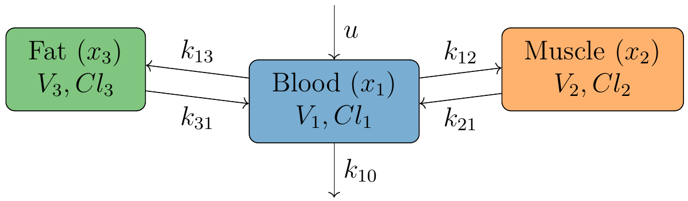
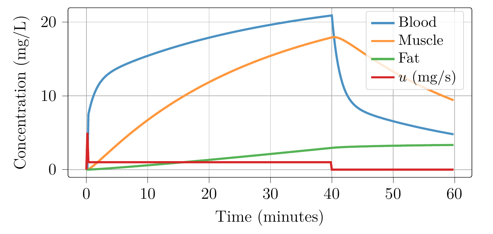
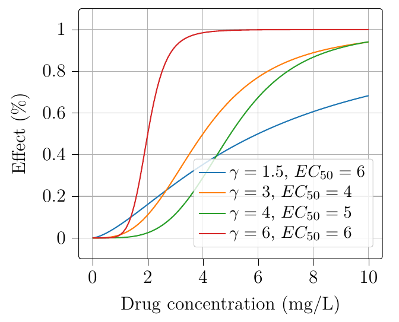
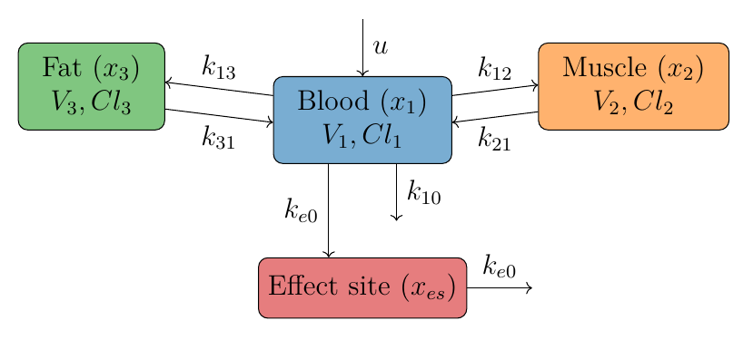
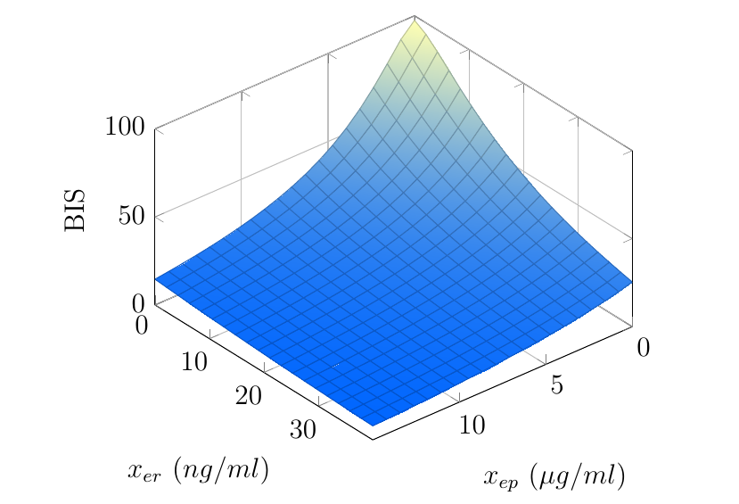

Modelling Anesthesia
================================

In the practice of pharmacology, models of drugs effect are usually separated into two sub-categories: Pharmacokinetic (PK) and pharmacodynamic (PD). The PK model describes the time evolution of the drug concentration in the body after an injection, and the PD models describe the effect of a given drug concentration on a physiological variable.

Pharmacokinetics
----------------

The most common approach for modeling pharmacokinetics is based on compartmental models. The concept is to consider the body as one or several compartments and describe the drug concentration in each compartment (Bailey2005_). The drug is assumed to be homogeneously distributed in each compartment, and the transport rate between compartments is assumed to be proportional to the drug concentration. Although this is a crude simplification of reality, it is a powerful tool for the prediction of the drug concentration in the body. Moreover, the freedom of the number of compartments allows to reach a good compromise between accuracy and complexity depending on available data.

   Three-compartment model for propofol and remifentanil.

For propofol and remifentanil, a three-compartment model is commonly used, see the figure above. The first compartment is the central compartment, which represents blood and highly perfused organs such as the heart, brain, kidney and liver. Then the two peripherical compartments respectively represent the highly perfused tissues such as muscles, and the poorly perfused tissues such as fat. The model results in a dynamical system described by the following state-space representation:

.. math::

    \begin{pmatrix}
    \dot{x}_1(t) \\ \dot{x}_2 (t)\\ \dot{x}_3(t)
    \end{pmatrix}
    =
    \begin{pmatrix}
    -(k_{10} + k_{12} + k_{13}) & k_{12} & k_{13} \\
    k_{21} & -k_{21} & 0\\
    k_{31} & 0 & -k_{31}
    \end{pmatrix}
    \begin{pmatrix}
    x_1 (t)\\ x_2 (t)\\ x_3(t)
    \end{pmatrix}
    +
    \begin{pmatrix}
    \frac{1}{V_1} \\ 0\\ 0
    \end{pmatrix}
    u(t)

where :math:`x_1(t), x_2(t)` and :math:`x_3(t)` respectively represent drug concentration in blood, muscle and fat in :math:`\mathrm{mg/ml}` for propofol and :math:`\mathrm{µg/ml}` for remifentanil. The coefficients can be obtained from the equations below, all in :math:`\mathrm{ml/s}`:

.. math::

    k_{10} = \frac{Cl_1}{V_1},\quad
    k_{12} = \frac{Cl_2}{V_1},\quad
    k_{13} = \frac{Cl_3}{V_1},\quad
    k_{21} = \frac{Cl_2}{V_2},\quad
    k_{31} = \frac{Cl_3}{V_3}

where :math:`V_i` and :math:`Cl_i` for :math:`i \in \{1,2,3\}` are, respectively, the volumes and the clearance rates of each compartment. The input :math:`u(t)` is the drug infusion rate in :math:`\mathrm{mg/s}` for propofol and :math:`\mathrm{µg/s}` for remifentanil.

Multiple studies have been conducted to estimate the parameters of the PK model for propofol and remifentanil depending on the patient's characteristics (age, height, weight, and sex). The most commonly used in clinical practice are the models of Scnnider1999_ and Marsh1991_ for propofol, and the model of Minto1997_ for remifentanil. However, two more recent studies made by Eleveld et al. (Eleveld2018_, Eleveld2017_) respectively for propofol and remifentanil, gather much more data and could be considered as the state of the art.

   Simulated propofol concentration for a 3-compartment model.

For norepinephrine, there is less studies focused on modelling, in Beloeil2005_ the authors have proposed a single compartment model given by the following equation:

.. math::
    \dot{x}(t) = \frac{Cl}{V} x(t) \frac{1}{V} u(t)

where :math:`V` and :math:`Cl` are, respectively, the volume and the clearance rate of the single compartment. :math:`x(t)` is directly the blood concentration of norepinephrine.

Pharmacodynamics
----------------

While the mechanism of the pharmacokinetic is still poorly understood, the mechanism of actions of drugs at the molecular level is better understood (Bailey2005_). However, the link between the molecular level and the measured physiological variables is complex and thus, the pharmacodynamics models are usually empirical. The most common approach is to use the Hill function to describe the effect of the drug concentration on the physiological variables. The Hill function is a sigmoid function defined by the following equation:

.. math::

    E(t) = E_{max} \frac{C(t)^\gamma}{C(t)^\gamma + EC_{50}^\gamma}

where :math:`E(t)` is the effect of the drug at time :math:`t`, :math:`E_{max}` is the maximal effect, :math:`C(t)` is the drug concentration at time :math:`t`, :math:`\gamma` is the Hill coefficient, and :math:`EC_{50}` is the half-effect concentration (i.e., the concentration to obtain half the effect of the drugs). Figure below is an illustration of the sigmoid function for different values of the Hill coefficient and half-effect concentration.

   Sigmoid function for different values of the Hill coefficient and half-effect concentration.

For propofol and remifentanil, before applying the Hill function, an effect-site compartment is added to the PK model to represent a delay between a rise of drug concentration in blood and the occurrence of the effect. This delay is dependent on the physiological variables, and thus, multiple effect-site compartments can be added to the model. As those compartments are virtual, the drug transfer is considered in only one direction, from blood to the effect site without affecting the blood compartment concentration. Thus, the addition of the effect site does not affect the PK model. The equation for one effect-site compartment is given by:

.. math::

    \dot{x}_{es}(t) = k_{e0} (x_1(t) - x_{es}(t))

where :math:`x_{es}(t)` is the drug concentration in the effect site, :math:`x_1(t)` is the drug concentration in blood, and :math:`k_{e0}` is the rate of drug transfer from blood to effect site. This leads to the full compartment model given in the next figure.

   Four-compartment model for propofol and remifentanil.

If pharmacokinetics models usually assume no interaction between drugs, pharmacodynamics models should express the synergy or the antagonism between drugs. For the effect of propofol and remifentanil on the BIS, a 3D-Hill function is used to express the drug's synergy:

.. math::
    :label: eq:3DHill

    BIS(t) = BIS_{0} - E_{max} \frac{I(t)^\gamma}{1 + I(t)^\gamma}

with :math:`BIS_0` the initial BIS, :math:`E_{max}` the maximum effect of combined drugs, :math:`\gamma` the slope coefficient of the Hill curve and :math:`I(t)` the interaction term defined by:

.. math::

    I(t) = \frac{I_p(t) + I_r(t)}{1 - \beta \theta(t) + \beta \theta(t)^2}

where:

.. math::

    I_p(t) = \frac{x_{ep,BIS}(t)}{C_{50p,BIS}};\quad
    I_r(t) = \frac{x_{er,BIS}(t)}{C_{50r,BIS}};\quad
    \theta(t) = \frac{I_p(t)}{I_p(t)+I_r(t)}

In those equations, :math:`x_{ep,BIS}` and :math:`x_{er,BIS}` are the propofol and remifentanil concentrations of the BIS effect site, :math:`C_{50p,BIS}` and :math:`C_{50r,BIS}` are the propofol and remifentanil half-effect concentrations for BIS, and :math:`\beta` is the interaction term between the two drugs.

Few studies have been conducted on the pharmacodynamic part of the anesthesia process, and the models are less standardized. In this simulator, the values of the parameters of the 3D-Hill function are taken from the study of Bouillon2004_. The surface of the 3D-Hill function with the values from the mentioned study is shown in the figure below.

   3D-Hill function for the effect of propofol and remifentanil on the BIS.

To output an indicator of analgesia in the simulator, we used  

For the effect of propofol and remifentanil on mean arterial pressure (MAP), the interaction of drugs has still to be studied. Thus, the effect of propofol, remifentanil and norepinephrine is considered to be independent and additive. The influence of propofol on MAP has been studied in Jeleazcov2015_, the influence of remifentanil in Standing2010_ and the one of norepinephrine in Beloeil2005_. For propofol, the authors of Jeleazcov2015_ find that the use of two different effect-site compartments better represents the effect of propofol on MAP. The model is given by:

.. math::

    MAP(t) =  MAP_0 - \underbrace{E_{max,r}\frac{x_{er,hemo}^{\gamma_{r}}}{C_{50r,MAP}^{\gamma_{r}} + x_{er,hemo}^{\gamma_{r}}}}_{\text{remifentanil effect}} 
    - \underbrace{E_{max,p}  \frac{I_p}{1 + I_p}}_{\text{propofol effect}} + \underbrace{E_{max,n}\frac{x_{n}^{\gamma_{r}}}{C_{50n,MAP}^{\gamma_{n}} + x_{n}^{\gamma_{r}}}}_{\text{norepinephrine effect}}

with:

.. math::

    I_p = \left( \frac{x_{ep,hemo,1}(t)}{C_{50p,MAP,1}}\right)^{\gamma_{p1}} + \left(\frac{x_{ep,hemo,2}(t)}{C_{50p,MAP,2}}\right)^{\gamma_{p2}}

where :math:`MAP_0` is the MAP baseline, :math:`E_{max,r}`, :math:`E_{max,p}` and :math:`E_{max,n}` are the maximal effects of remifentanil, propofol and norepinephrine on MAP, :math:`x_{er,hemo}`, :math:`x_{ep,hemo,1}`, :math:`x_{ep,hemo,2}` and :math:`x_{n}` are the remifentanil and propofol, and norepinephrine concentrations in the MAP effect site, or blood compartment for norepinephrine. :math:`C_{50r,MAP}`, :math:`C_{50p,MAP,1}`, :math:`C_{50p,MAP,2}`, :math:`C_{50n,MAP}`, :math:`\gamma_{r}`, :math:`\gamma_{p1}`, :math:`\gamma_{p2}`, and :math:`\gamma_{n}`, are the half-effect concentrations and Hill coefficients of remifentanil and propofol and norepinephrine.

For the effect on cardiac output (CO), there is even less studies are scarce. As for MAP, we considered additive drug effect, without any synergic effect. Because no sigmoid model was available in the litterature, we infer value to match experimental values from the following papers: Fairfield1991_ for propofol, Chanavaz2005_ for remifentanil and Monnet2011_ for  norepinephrine. We used the same effect sites than the one from MAP, for propofol the mean concentration between the two efefct site compartment is used. Note that this is a crude simplification.

.. math::

    CO(t) =  CO_0 - \underbrace{E_{max,r}\frac{x_{er,hemo}^{\gamma_{r}}}{C_{50r,CO}^{\gamma_{r}} + x_{er,hemo}^{\gamma_{r}}}}_{\text{remifentanil effect}} 
    - \underbrace{E_{max,p}\frac{x_{p,hemo}^{\gamma_{p}}}{C_{50p,CO}^{\gamma_{p}} + x_{p,hemo}^{\gamma_{p}}}}_{\text{propofol effect}} + \underbrace{E_{max,n}\frac{x_{n}^{\gamma_{r}}}{C_{50n,CO}^{\gamma_{n}} + x_{n}^{\gamma_{r}}}}_{\text{norepinephrine effect}}

with:

.. math::

    x_{p,hemo}(t) = \frac{x_{ep,hemo,1}(t)+x_{ep,hemo,2}(t)}{2}

where :math:`CO_0` is the MAP baseline, :math:`E_{max,r}`, :math:`E_{max,p}` and :math:`E_{max,n}` are the maximal effects of remifentanil, propofol and norepinephrine on CO, :math:`x_{er,hemo}`, :math:`x_{ep,hemo,1}`, :math:`x_{ep,hemo,2}` and :math:`x_{n}` are the remifentanil and propofol, and norepinephrine concentrations in the MAP effect site, or blood compartment for norepinephrine. :math:`C_{50r,CO}`, :math:`C_{50p,CO}`, :math:`C_{50n,CO}`, :math:`\gamma_{r}`, :math:`\gamma_{p}`, and :math:`\gamma_{n}`, are the half-effect concentrations and Hill coefficients of remifentanil and propofol and norepinephrine.

The overall model of the anesthesia process is then given by connecting the PK model and the PD model as illustrated in the figure below. This can be formalized as a model with a linear dynamic and a non-linear output function in the following state-space representation:

.. math::
    :label: eq:standard_model

    \begin{cases}
        \dot{x}(t) = A x(t) + B u(t) \\
        y(t) = h(x(t))
    \end{cases}

where :math:`x(t)` is the system state, including the drug concentrations of propofol, remifentanil and norepinephrine in each compartment, and :math:`y(t)` is the output of the system, *i.e.*, the BIS, TOL, MAP, and CO.

.. .. figure:: ./images/standard_model.png
   :width: 90%
   :align: center
   :alt: Complete model

..   Complete model of propofol and remifentanil effect on BIS and MAP. The red, dark and blue arrows respectively represent the drug injection, the drug transfer between the compartments and the drug clearance of the different compartments.

Non-linear interactions 
-----------------------
Cardiac output dependency
~~~~~~~~~~~~~~~~~~~~~~~~~
Several studies have shown the influence of cardiac output (CO) on the pharmacokinetics of propofol (Adachi2001_; Kurita2002_; Upton1999_). In Bienert2020_, the authors proposed the assumption that the clearance rate of propofol and fentanil could be proportional to CO resulting in a non-constant clearance rate. In the simulator, the same assumption is made for propofol and extended to remifentanil and norepinephrine clearance rates in the PK model. 

.. math::
    Cl = Cl_0 \frac{CO}{CO_0}

Where :math:`Cl` denotes all the clearances rates of each drugs and each compartment, and :math:`Cl_0` and :math:`CO_0` the initial clearance rates and cardiac output.

This behavior can be activated or deactivated (default) to simulate the interaction between CO and the PK systems.

Blood loss modelling
~~~~~~~~~~~~~~~~~~~~
When important, blood loss can be considered as a shock situation for the patient. It strongly affect the haemodynamic system and also all the inner working of multiple organs in the body. Regarding anesthesia modelling, blood loss is known to change the distribution of drugs in the body (Johnson2001_, Johnson2003_; Kurita2009_). In fact, the reduced volume of blood will affect the PK system of the drugs. Thus, during a blood loss simulation the blood volume (first compartment volume) is updated in all the PK models. For this, we consider the volume of the first compartment of propofol as the "true" volume of blood in the patient body and update the other PK model according to the fraction of the remaining blood volume over the initial blood volume.

In addition to the effect of blood loss in the PK models, the crude assumption that MAP and CO are proportional to the blood volume is made in the simulator. The transient behavior of bleeding and transfusion does not verify this assumption, however the steady-state experimental values do agree with it (Rinehart2011_). A more complex hemodynamic model should be integrated to obtain better results. The simulator also takes into account the fact that the BIS pharmacodynamics depends on bleeding (Kurita2009_) leading to a deeper hypnosis state, again value for this dependencies have been chosen to match the experimentals results of the paper.

In case of bleeding, considering :math:`\rho = \frac{V_{1,p}(t)}{V_{1,p}(0)}` with :math:`V_{1,p}(0)` the initial first compartment volume of propofol PK model and :math:`V_{1,p}(t)` the volume updated thanks to the rates of blood loss given by the user, the equations are the following:

.. raw:: html

    

    \[
    V_1(t) = \rho V_1(0)
    \]
    \[
    MAP(t) = \rho MAP^*(t)
    \]
    \[
    CO(t) = \rho CO^*(t)
    \]
    \[
    C_{50p,BIS}(t) = C_{50p,BIS}(0) - 6(1-\rho)
    \]
    

where :math:`V_1(t)` is the volume of the first compartment of all drug PK model, :math:`MAP^*(t)` and :math:`CO^*(t)` the mean arterial pressure and cardiac output without considering blood loss and :math:`C_{50p,BIS}(t)` the half effect concentration of propofol on BIS. 

Note that with this modelling approach, because the PK model is affected both by the loss of blood volume and reduction of cardiac output, the time constant of the system are not importantly affected. However, as the blood volume is reduced and the patient sensitivity to propofol increase, the BIS will decrease quickly if the rates of propofol is not updated.

References
----------

.. [Bailey2005]     J. M. Bailey and W. M. Haddad, “Drug dosing control in clinical pharmacology,” *IEEE Control Systems Magazine*,
    vol. 25, no. 2, pp. 35–51, Apr. 2005, doi: https://doi.org/10.1109/MCS.2005.1411383.
.. [Scnnider1999]    T. W. Schnider et al., “The Influence of Age on Propofol Pharmacodynamics,” Anesthesiology,
    vol. 90, no. 6, pp. 1502-1516., Jun. 1999, doi: https://doi.org/10.1097/00000542-199906000-00003.
.. [Marsh1991]   B. Marsh, M. White, N. morton, and G. N. C. Kenny, “Pharmacokinetic model Driven Infusion of Propofol
    in Children,” BJA: British Journal of Anaesthesia, vol. 67, no. 1, pp. 41–48, Jul. 1991, doi: https://doi.org/10.1093/bja/67.1.41.
.. [Minto1997]  C. F. Minto et al., “Influence of Age and Gender on the Pharmacokinetics and Pharmacodynamics of Remifentanil:
    I. Model Development,” Anesthesiology, vol. 86, no. 1, pp. 10–23, Jan. 1997, doi: https://doi.org/10.1097/00000542-199701000-00004.
.. [Eleveld2018]    D. J. Eleveld, P. Colin, A. R. Absalom, and M. M. R. F. Struys, “Pharmacokinetic–pharmacodynamic model
    for propofol for broad application in anaesthesia and sedation” British Journal of Anaesthesia, vol. 120, no. 5, pp. 942–959, mai 2018,
    doi: https://doi.org/10.1016/j.bja.2018.01.018.
.. [Eleveld2017]    D. J. Eleveld et al., “An Allometric Model of Remifentanil Pharmacokinetics and Pharmacodynamics,”
    Anesthesiology, vol. 126, no. 6, pp. 1005–1018, juin 2017, doi: https://doi.org/10.1097/ALN.0000000000001634.
..  [Beloeil2005]  H. Beloeil, J.-X. Mazoit, D. Benhamou, and J. Duranteau, “Norepinephrine kinetics and dynamics
    in septic shock and trauma patients,” BJA: British Journal of Anaesthesia, vol. 95, no. 6,
    pp. 782–788, Dec. 2005, doi: https://doi.org/10.Beloeil20051093/bja/aei259.
.. [Bouillon2004] T. W. Bouillon et al., “Pharmacodynamic Interaction between Propofol and Remifentanil
    Regarding Hypnosis, Tolerance of Laryngoscopy, Bispectral Index, and Electroencephalographic Approximate
    Entropy,” Anesthesiology, vol. 100, no. 6, pp. 1353–1372, Jun. 2004, doi: https://doi.org/10.1097/00000542-200406000-00006.
.. [Ionescu2021] Ionescu, C. M., Neckebroek, M., Ghita, M., & Copot, D. (2021). An Open Source Patient
    Simulator for Design and Evaluation of Computer Based Multiple Drug Dosing Control for Anesthetic and
    Hemodynamic Variables. IEEE Access, 9, 8680–8694. https://doi.org/10.1109/ACCESS.2021.3049880
.. [Jeleazcov2015] C. Jeleazcov, M. Lavielle, J. Schüttler, and H. Ihmsen, “Pharmacodynamic response modelling
    of arterial blood pressure in adult volunteers during propofol anaesthesia,” BJA: British Journal of Anaesthesia,
    vol. 115, no. 2, pp. 213–226, Aug. 2015, doi: https://doi.org/10.1093/bja/aeu553.
.. [Standing2010] J. F. Standing, G. B. Hammer, W. J. Sam, and D. R. Drover, “Pharmacokinetic–pharmacodynamic
    modeling of the hypotensive effect of remifentanil in infants undergoing cranioplasty,” Pediatric Anesthesia,
    vol. 20, no. 1, pp. 7–18, 2010, doi: https://doi.org/10.1111/j.1460-9592.2009.03174.x.
.. [Fairfield1991] J. E. Fairfield, A. Dritsas, and R. J. Beale, “Haemodynamic effects of propofol:
    induction with 2.5 mg/kg,” British Journal of Anaesthesia, vol. 67, no. 5,
    pp. 618–620, Nov. 1991, doi: https://doi.org/10.1093/bja/67.5.618.
.. [Chanavaz2005] C. Chanavaz et al., “Haemodynamic effects of remifentanil in children
    with and without intravenous atropine. An echocardiographic study,”
    BJA: British Journal of Anaesthesia, vol. 94, no. 1, pp. 74–79, Jan. 2005, doi: https://doi.org/10.1093/bja/aeh293.
..  [Monnet2011]  X. Monnet, J. Jabot, J. Maizel, C. Richard, and J.-L. Teboul, “Norepinephrine increases
    cardiac preload and reduces preload dependency assessed by passive leg raising in septic shock patients”
    Critical Care Medicine, vol. 39, no. 4, p. 689, Apr. 2011, doi: https://doi.org/10.1097/CCM.0b013e318206d2a3.
.. [Adachi2001] Adachi, Y. U., Watanabe, K., Higuchi, H., & Satoh, T. (2001).
    The Determinants of Propofol Induction of Anesthesia Dose. Anesthesia & Analgesia,
    92(3), 656. https: //doi.org/10.1213/00000539-200103000-00020
.. [Kurita2002] Kurita, T., Takata, K., Morita, K., Morishima, Y., Uraoka, M., Katoh, T., & Sato, S. (2009).
    The Influence of Hemorrhagic Shock on the Electroencephalographic and Immobilizing
    Effects of Propofol in a Swine Model. Anesthesia & Analgesia, 109(2), 398–404.
    https: //doi.org/10.1213/ane.0b013e3181a96f9a
.. [Upton1999] Upton, R. N., Ludbrook, G. L., Grant, C., & Martinez, A. M. (1999).
    Cardiac Output is a Determinant of the Initial Concentrations of Propofol After
    Short-Infusion Administration. Anesthesia & Analgesia, 89(3), 545.
    https://doi.org/10.1213/00000539-199909000-00002
.. [Bienert2020] Bienert, A., Sobczyński, P., Młodawska, K., Hartmann-Sobczyńska,
    R., Grześkowiak, E., & Wiczling, P. (2020). The influence of cardiac output
    on propofol and fentanyl pharmacokinetics and pharmacodynamics in patients
    undergoing abdominal aortic surgery. Journal of Pharmacokinetics and Pharmacodynamics,
    47 (6), 583–596. https://doi.org/10.1007/ s10928-020-09712-1
.. [Johnson2001] Johnson, K. B., Kern, S. E., Hamber, E. A., McJames, S. W., Kohnstamm,
    K. M., & Egan, T. D. (2001). Influence of Hemorrhagic Shock on Remifentanil:
    A Pharmacokinetic and Pharmacodynamic Analysis. Anesthesiology, 94(2), 322–332.
    https://doi.org/10.1097/ 00000542-200102000-00023
.. [Johnson2003] Johnson, K. B., Egan, T. D., Kern, S. E., White, J. L., McJames, S. W., Syroid,
    N., Whiddon, D., & Church, T. (2003). The Influence of Hemorrhagic Shock on Propofol:
    A Pharmacokinetic and Pharmacodynamic Analysis. Anesthesiology, 99(2), 409–420.
    https://doi.org/10.1097/00000542-200308000-00023
.. [Kurita2009] Kurita, T., Takata, K., Morita, K., Morishima, Y., Uraoka, M., Katoh,
    T., & Sato, S. (2009). The Influence of Hemorrhagic Shock on the
    Electroencephalographic and Immobilizing Effects of Propofol in a Swine Model.
    Anesthesia & Analgesia, 109(2), 398–404. https: //doi.org/10.1213/ane.0b013e3181a96f9a
.. [Rinehart2011] Rinehart, J., Alexander, B., Manach, Y. L., Hofer, C. K., Tavernier,
    B., Kain, Z. N., & Cannesson, M. (2011). Evaluation of a novel closed-loop
    fluid-administration system based on dynamic predictors of fluid responsiveness:
    An in silico simulation study. Critical Care, 15(6), R278. https://doi.org/10.1186/cc10562